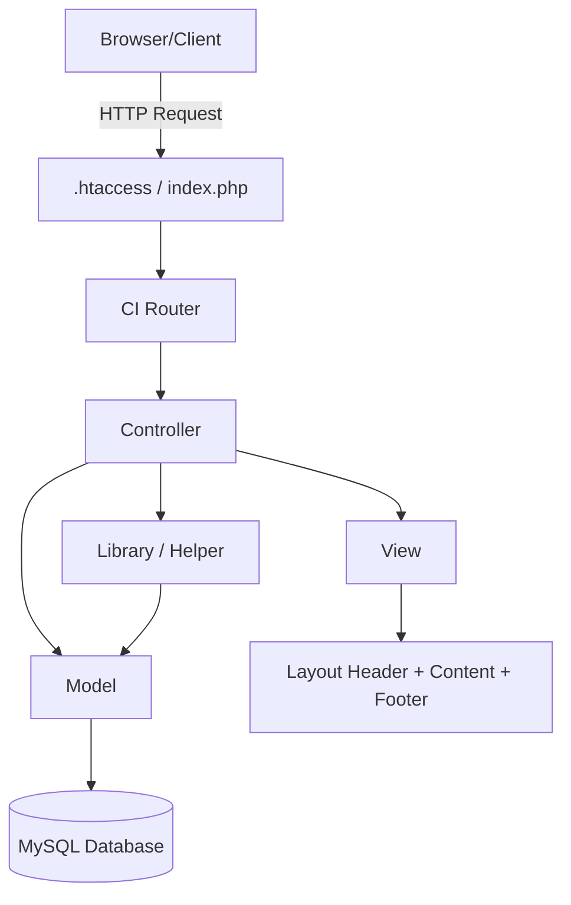
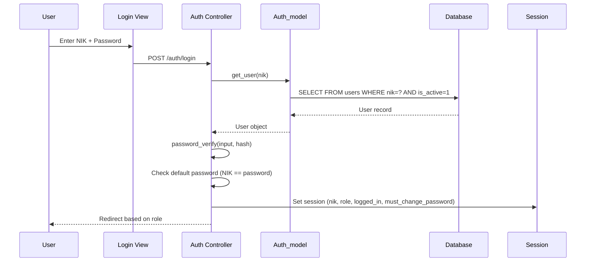
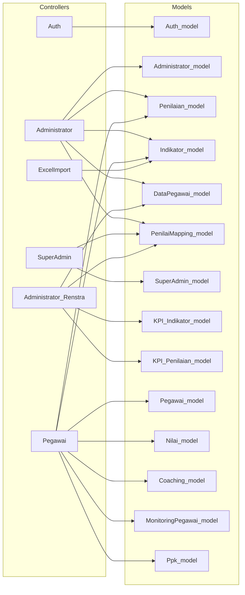

# 02 — Architecture

## Framework
**CodeIgniter 3.x** (latest 3.1.x branch) — MVC Architecture

## Architecture Pattern
Classic **Model–View–Controller (MVC)** with the following layers:



## Request Lifecycle

```
1. Client sends HTTP Request
2. .htaccess rewrites URL → index.php
3. index.php bootstraps CodeIgniter
4. CI_Router parses URI → maps to Controller/Method
5. Controller constructor:
   - Loads required Models
   - Checks session authentication & role authorization
   - Redirects to `auth` if unauthorized
6. Controller method:
   - Reads input (GET/POST)
   - Calls Model methods for data operations
   - Prepares $data array
   - Loads Views (header → content → footer)
7. View renders HTML/JSON response
8. CI_Output sends response to client
```

## Authentication Flow



## Layered Architecture

| Layer | Folder | Responsibility |
|-------|--------|----------------|
| **Routing** | `config/routes.php` | URL → Controller mapping |
| **Controller** | `controllers/` | Request handling, auth guard, business orchestration |
| **Model** | `models/` | Database queries, CRUD, business logic |
| **View** | `views/` | HTML rendering, JS-based AJAX interaction |
| **Library** | `libraries/` | Reusable utilities (Excel) |
| **Config** | `config/` | System & app configuration |
| **Assets** | `assets/` | CSS, JS, images, third-party plugins |

## Layout System
Each role uses a separate layout wrapper:

| Role | Header | Footer | Content Folder |
|------|--------|--------|----------------|
| Administrator | `layout/header.php` | `layout/footer.php` | `administrator/` |
| Pegawai | `layoutpegawai/header.php` | `layoutpegawai/footer.php` | `pegawai/` |
| SuperAdmin | `layoutsuperadmin/header.php` | `layoutsuperadmin/footer.php` | `superadmin/` |
| Admin Renstra | `layoutrenstra/header.php` | `layoutrenstra/footer.php` | `administrator_renstra/` |

## Component Dependency Map



## Key Design Decisions
1. **No ORM** — Uses CodeIgniter Query Builder for all database operations
2. **Session-based Auth** — File-based sessions (not DB), 2-hour expiry
3. **Role-based Access** — Checked in constructor of each controller
4. **AJAX-heavy UI** — Most data operations use AJAX (jQuery $.ajax / fetch)
5. **Excel Integration** — PHPSpreadsheet for import/export of data
6. **Multi-tier Assessment** — Penilai I, Penilai II, Administrator verification workflow
