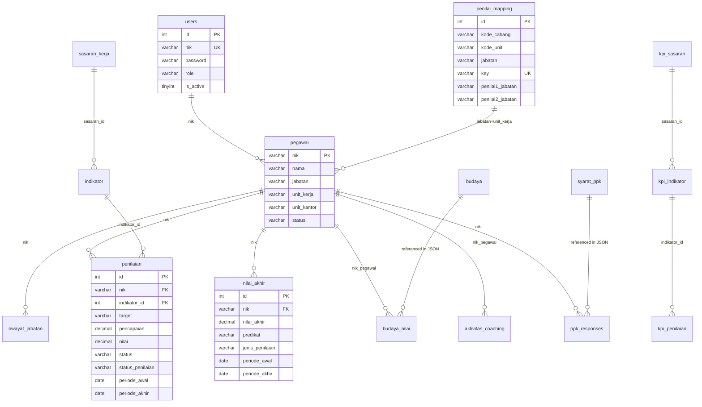

# 04 — Database Documentation

## Database Info
- **Name**: `ski-brk`
- **Driver**: `mysqli`
- **Charset**: `utf8` / `utf8_general_ci`
- **Host**: `localhost`
- **Credentials**: root / (empty) — **⚠️ HARUS DIUBAH DI PRODUCTION**

**Source**: [database.php](file:///d:/Laragon/laragon/www/SKI-BRK/application/config/database.php)

---

## Database Tables (Identified from Source Code)

### 1. `users` — Tabel Autentikasi
| Kolom | Tipe | Fungsi |
|-------|------|--------|
| `id` | INT PK AUTO_INCREMENT | Primary key |
| `nik` | VARCHAR UNIQUE | NIK pegawai (login identifier) |
| `password` | VARCHAR | Bcrypt hashed password |
| `role` | VARCHAR | Role: superadmin, administrator, administrator_renstra, pegawai |
| `is_active` | TINYINT(1) | Status aktif (1=aktif, 0=nonaktif) |

### 2. `pegawai` — Data Master Pegawai
| Kolom | Tipe | Fungsi |
|-------|------|--------|
| `nik` | VARCHAR PK/UNIQUE | NIK pegawai |
| `nama` | VARCHAR | Nama lengkap |
| `jabatan` | VARCHAR | Jabatan saat ini |
| `unit_kerja` | VARCHAR | Unit kerja (jenis cabang/divisi) |
| `unit_kantor` | VARCHAR | Nama kantor |
| `password` | VARCHAR | Password hash (duplikat dari users) |
| `status` | VARCHAR | Status pegawai (aktif/nonaktif) |
| `ppk_eligible` | TINYINT(1) | Kelayakan PPK (0/1) |

### 3. `riwayat_jabatan` — Riwayat Mutasi Jabatan
| Kolom | Tipe | Fungsi |
|-------|------|--------|
| `id` | INT PK | Primary key |
| `nik` | VARCHAR FK→pegawai | NIK pegawai |
| `jabatan` | VARCHAR | Jabatan di periode tersebut |
| `unit_kerja` | VARCHAR | Unit kerja |
| `unit_kantor` | VARCHAR | Nama kantor |
| `tgl_mulai` | DATE | Tanggal mulai jabatan |
| `tgl_selesai` | DATE NULL | Tanggal akhir jabatan |
| `status` | VARCHAR | aktif/nonaktif |

### 4. `penilai_mapping` — Mapping Hierarki Penilai
| Kolom | Tipe | Fungsi |
|-------|------|--------|
| `id` | INT PK | Primary key |
| `kode_cabang` | VARCHAR | Kode cabang bank |
| `kode_unit` | VARCHAR | Kode unit dalam cabang |
| `unit_kantor` | VARCHAR | Nama kantor |
| `unit_kerja` | VARCHAR | Unit kerja |
| `jabatan` | VARCHAR | Nama jabatan |
| `jenis_penilaian` | VARCHAR | SKI / KPI |
| `penilai1_jabatan` | VARCHAR FK→self.key | Key mapping penilai 1 |
| `penilai2_jabatan` | VARCHAR FK→self.key | Key mapping penilai 2 |
| `key` | VARCHAR UNIQUE | Unique key untuk hierarki |
| `updated_at` | TIMESTAMP | Waktu update |

### 5. `sasaran_kerja` — Sasaran Kerja (SKI)
| Kolom | Tipe | Fungsi |
|-------|------|--------|
| `id` | INT PK | Primary key |
| `jabatan` | VARCHAR | Jabatan terkait |
| `unit_kerja` | VARCHAR | Unit kerja |
| `perspektif` | VARCHAR | Perspektif BSC (Keuangan, Pelanggan, dll) |
| `sasaran_kerja` | TEXT | Deskripsi sasaran kerja |
| `owner_nik` | VARCHAR NULL | NIK pemilik (NULL=master/default) |

### 6. `indikator` — Indikator Kinerja
| Kolom | Tipe | Fungsi |
|-------|------|--------|
| `id` | INT PK | Primary key |
| `sasaran_id` | INT FK→sasaran_kerja | Sasaran kerja terkait |
| `indikator` | TEXT | Deskripsi indikator |
| `bobot` | DECIMAL | Bobot persentase |
| `owner_nik` | VARCHAR NULL | NIK pemilik (NULL=master) |

### 7. `penilaian` — Tabel Penilaian SKI
| Kolom | Tipe | Fungsi |
|-------|------|--------|
| `id` | INT PK | Primary key |
| `nik` | VARCHAR FK→pegawai | NIK pegawai dinilai |
| `indikator_id` | INT FK→indikator | Indikator yang dinilai |
| `target` | TEXT | Target yang ditetapkan |
| `batas_waktu` | DATE | Batas waktu pencapaian |
| `realisasi` | TEXT | Realisasi pencapaian |
| `pencapaian` | DECIMAL | Persentase pencapaian |
| `nilai` | DECIMAL | Nilai |
| `nilai_dibobot` | DECIMAL | Nilai × Bobot |
| `status` | VARCHAR | Status review penilai 1 |
| `status2` | VARCHAR | Status review penilai 2 |
| `status_penilaian` | VARCHAR | Status keseluruhan (belum dinilai/disetujui/selesai) |
| `lock_input` | TINYINT | Lock input pegawai (penilai 1 kontrol) |
| `lock_input2` | TINYINT | Lock input pegawai (penilai 2 kontrol) |
| `periode_awal` | DATE | Awal periode penilaian |
| `periode_akhir` | DATE | Akhir periode penilaian |

### 8. `nilai_akhir` — Rekapitulasi Nilai Akhir
| Kolom | Tipe | Fungsi |
|-------|------|--------|
| `id` | INT PK | Primary key |
| `nik` | VARCHAR FK→pegawai | NIK pegawai |
| `nilai_sasaran` | DECIMAL | Rata-rata nilai sasaran |
| `nilai_budaya` | DECIMAL | Rata-rata nilai budaya |
| `share_kpi_value` | DECIMAL | Nilai share KPI |
| `total_nilai` | DECIMAL | Total nilai gabungan |
| `fraud` | DECIMAL | Faktor fraud/penalty |
| `nilai_akhir` | DECIMAL | Nilai akhir setelah fraud |
| `pencapaian` | DECIMAL | Persentase pencapaian |
| `predikat` | VARCHAR | Predikat (Minus/Fair/Good/Very Good/Excellent) |
| `koefisien` | DECIMAL | Koefisien |
| `bobot_sasaran` | DECIMAL | Bobot komponen sasaran |
| `bobot_budaya` | DECIMAL | Bobot komponen budaya |
| `bobot_share_kpi` | DECIMAL | Bobot komponen share KPI |
| `jenis_penilaian` | VARCHAR | SKI / KPI |
| `status_penilaian` | VARCHAR | Status (disetujui/selesai) |
| `periode_awal` | DATE | Periode awal |
| `periode_akhir` | DATE | Periode akhir |
| `created_at` | TIMESTAMP | Tanggal buat |
| `updated_at` | TIMESTAMP | Tanggal update |

### 9. `budaya` — Master Perilaku Budaya Kerja
| Kolom | Tipe | Fungsi |
|-------|------|--------|
| `id` | INT PK | Primary key |
| `perilaku` | TEXT | Nama perilaku budaya |
| `panduan` | TEXT | Panduan perilaku |

### 10. `budaya_nilai` — Nilai Budaya Per Pegawai
| Kolom | Tipe | Fungsi |
|-------|------|--------|
| `id` | INT PK | Primary key |
| `nik_pegawai` | VARCHAR FK→pegawai | NIK pegawai |
| `nilai_budaya` | TEXT (JSON) | JSON mapping id_budaya → nilai |
| `rata_rata` | DECIMAL | Rata-rata nilai budaya |
| `status_penilaian` | VARCHAR | Status |
| `periode_awal` | DATE | Periode awal |
| `periode_akhir` | DATE | Periode akhir |

### 11. `aktivitas_coaching` — Chat Coaching
| Kolom | Tipe | Fungsi |
|-------|------|--------|
| `id` | INT PK | Primary key |
| `nik_pegawai` | VARCHAR | NIK pegawai yang di-coaching |
| `pengirim_nik` | VARCHAR | NIK pengirim pesan |
| `pesan/catatan` | TEXT | Isi pesan |

### 12. `catatan_penilai` — Catatan dari Penilai
| Kolom | Tipe | Fungsi |
|-------|------|--------|
| `id` | INT PK | Primary key |
| `nik_pegawai` | VARCHAR | NIK yang dinilai |
| `nik_penilai` | VARCHAR | NIK penilai |
| `catatan` | TEXT | Isi catatan |
| `tanggal` | DATE | Tanggal catatan |

### 13. `catatan_pegawai` — Catatan dari Pegawai
| Kolom | Tipe | Fungsi |
|-------|------|--------|
| `id` | INT PK | Primary key |
| `nik` | VARCHAR | NIK pegawai |
| `catatan` | TEXT | Isi catatan |
| `tanggal` | DATE | Tanggal |

### 14. `kpi_sasaran` — Sasaran KPI (Renstra)
| Kolom | Tipe | Fungsi |
|-------|------|--------|
| `id` | INT PK | Primary key |
| `jabatan` | VARCHAR | Jabatan terkait |
| `unit_kerja` | VARCHAR | Unit kerja |
| `perspektif` | VARCHAR | Perspektif BSC |
| `sasaran_kpi` | TEXT | Deskripsi sasaran KPI |

### 15. `kpi_indikator` — Indikator KPI
| Kolom | Tipe | Fungsi |
|-------|------|--------|
| `id` | INT PK | Primary key |
| `sasaran_id` | INT FK→kpi_sasaran | Sasaran KPI terkait |
| `indikator` | TEXT | Deskripsi indikator |
| `bobot` | DECIMAL | Bobot persentase |

### 16. `kpi_penilaian` — Penilaian KPI
| Kolom | Tipe | Fungsi |
|-------|------|--------|
| `id` | INT PK | Primary key |
| `nik` | VARCHAR FK→pegawai | NIK pegawai |
| `indikator_id` | INT FK→kpi_indikator | Indikator yang dinilai |
| `target` | TEXT | Target |
| `batas_waktu` | DATE | Deadline |
| `realisasi` | TEXT | Realisasi |
| `pencapaian` | DECIMAL | Persentase pencapaian |
| `nilai` | DECIMAL | Nilai |
| `nilai_dibobot` | DECIMAL | Nilai × bobot |
| `status` | VARCHAR | Status |
| `periode_awal` | DATE | Periode awal |
| `periode_akhir` | DATE | Periode akhir |

### 17. `syarat_ppk` — Master Syarat PPK
| Kolom | Tipe | Fungsi |
|-------|------|--------|
| `id_ppk` | INT PK AUTO_INCREMENT | Primary key |
| `syarat` | TEXT | Deskripsi syarat PPK |
| `created_at` | TIMESTAMP | Tanggal buat |
| `updated_at` | TIMESTAMP | Tanggal update |

### 18. `ppk_responses` — Jawaban PPK per Pegawai
| Kolom | Tipe | Fungsi |
|-------|------|--------|
| `id` | INT PK AUTO_INCREMENT | Primary key |
| `nik` | VARCHAR UNIQUE | NIK pegawai |
| `answers` | TEXT (JSON) | JSON mapping id_ppk → answer (ya/tidak) |
| `created_at` | TIMESTAMP | Tanggal buat |
| `updated_at` | TIMESTAMP | Tanggal update |

---

## ERD (Entity Relationship Diagram)

## SQL Migration Files

| File | Fungsi |
|------|--------|
| [create_syarat_ppk.sql](file:///d:/Laragon/laragon/www/SKI-BRK/sql/create_syarat_ppk.sql) | Buat tabel `syarat_ppk` |
| [create_ppk_responses.sql](file:///d:/Laragon/laragon/www/SKI-BRK/sql/create_ppk_responses.sql) | Buat tabel `ppk_responses` (JSON per NIK) |
| [migrate_ppk_responses_to_json.sql](file:///d:/Laragon/laragon/www/SKI-BRK/sql/migrate_ppk_responses_to_json.sql) | Migrasi struktur per-row → JSON per NIK |
| [alter_pegawai_add_ppk_eligible.sql](file:///d:/Laragon/laragon/www/SKI-BRK/sql/alter_pegawai_add_ppk_eligible.sql) | Tambah kolom `ppk_eligible` ke `pegawai` |
