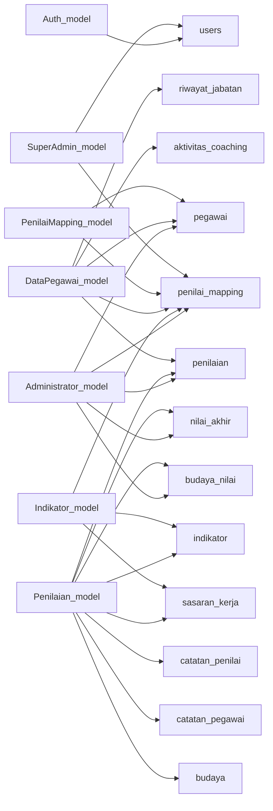

# 07 — Model Documentation

## Model Inventory

### Root Models (`application/models/`)

| # | Model | File | Table | Purpose |
|---|-------|------|-------|---------|
| 1 | Auth_model | [Auth_model.php](file:///d:/Laragon/laragon/www/SKI-BRK/application/models/Auth_model.php) | `users` | Login authentication |
| 2 | Administrator_model | [Administrator_model.php](file:///d:/Laragon/laragon/www/SKI-BRK/application/models/Administrator_model.php) | `pegawai`, `penilaian`, `nilai_akhir`, `penilai_mapping` | Dashboard stats & grafik |
| 3 | Penilaian_model | [Penilaian_model.php](file:///d:/Laragon/laragon/www/SKI-BRK/application/models/Penilaian_model.php) | `penilaian`, `nilai_akhir`, `budaya_nilai`, `catatan_*` | Core assessment CRUD |
| 4 | Indikator_model | [Indikator_model.php](file:///d:/Laragon/laragon/www/SKI-BRK/application/models/Indikator_model.php) | `indikator`, `sasaran_kerja`, `penilai_mapping` | Indicator & target management |
| 5 | DataPegawai_model | [DataPegawai_model.php](file:///d:/Laragon/laragon/www/SKI-BRK/application/models/DataPegawai_model.php) | `pegawai`, `riwayat_jabatan`, `penilaian`, `aktivitas_coaching` | Employee data management |
| 6 | PenilaiMapping_model | [PenilaiMapping_model.php](file:///d:/Laragon/laragon/www/SKI-BRK/application/models/PenilaiMapping_model.php) | `penilai_mapping`, `pegawai` | Assessor hierarchy mapping |
| 7 | SuperAdmin_model | [SuperAdmin_model.php](file:///d:/Laragon/laragon/www/SKI-BRK/application/models/SuperAdmin_model.php) | `users`, `penilai_mapping` | User & mapping management |
| 8 | DataDiri_model | [DataDiri_model.php](file:///d:/Laragon/laragon/www/SKI-BRK/application/models/DataDiri_model.php) | `pegawai` | Employee profile |
| 9 | RiwayatJabatan_model | [RiwayatJabatan_model.php](file:///d:/Laragon/laragon/www/SKI-BRK/application/models/RiwayatJabatan_model.php) | `riwayat_jabatan`, `pegawai` | Job history |
| 10 | Budaya_model | [Budaya_model.php](file:///d:/Laragon/laragon/www/SKI-BRK/application/models/Budaya_model.php) | `budaya` | Corporate culture values |
| 11 | Monitoring_model | [Monitoring_model.php](file:///d:/Laragon/laragon/www/SKI-BRK/application/models/Monitoring_model.php) | `penilaian`, `pegawai` | Performance monitoring |
| 12 | KPI_Indikator_model | [KPI_Indikator_model.php](file:///d:/Laragon/laragon/www/SKI-BRK/application/models/KPI_Indikator_model.php) | `kpi_sasaran`, `kpi_indikator` | KPI indicator management |
| 13 | KPI_Penilaian_model | [KPI_Penilaian_model.php](file:///d:/Laragon/laragon/www/SKI-BRK/application/models/KPI_Penilaian_model.php) | `kpi_penilaian`, `kpi_indikator` | KPI assessment |
| 14 | Syarat_ppk_model | [Syarat_ppk_model.php](file:///d:/Laragon/laragon/www/SKI-BRK/application/models/Syarat_ppk_model.php) | `syarat_ppk` | PPK requirements |
| 15 | Ppk_responses_model | [Ppk_responses_model.php](file:///d:/Laragon/laragon/www/SKI-BRK/application/models/Ppk_responses_model.php) | `ppk_responses` | PPK responses (JSON) |

### Pegawai Subfolder Models (`application/models/pegawai/`)

| # | Model | File | Table | Purpose |
|---|-------|------|-------|---------|
| 16 | Pegawai_model | [Pegawai_model.php](file:///d:/Laragon/laragon/www/SKI-BRK/application/models/pegawai/Pegawai_model.php) | `pegawai`, `penilaian`, `nilai_akhir` | Employee-side data access |
| 17 | Nilai_model | [Nilai_model.php](file:///d:/Laragon/laragon/www/SKI-BRK/application/models/pegawai/Nilai_model.php) | `penilaian`, `budaya_nilai`, `budaya` | Assessment values |
| 18 | Coaching_model | [Coaching_model.php](file:///d:/Laragon/laragon/www/SKI-BRK/application/models/pegawai/Coaching_model.php) | `aktivitas_coaching` | Coaching chat system |
| 19 | MonitoringPegawai_model | [MonitoringPegawai_model.php](file:///d:/Laragon/laragon/www/SKI-BRK/application/models/pegawai/MonitoringPegawai_model.php) | `penilaian`, `catatan_*` | Employee monitoring |
| 20 | Ppk_model | [Ppk_model.php](file:///d:/Laragon/laragon/www/SKI-BRK/application/models/pegawai/Ppk_model.php) | `ppk_responses`, `syarat_ppk` | PPK from employee side |

---

## Key Model Details

### Auth_model
- `get_user($nik)` — SELECT user WHERE nik=? AND is_active=1
- `insert_user($data)` — INSERT into users

### Penilaian_model (Core Business Logic)
- `get_indikator_by_jabatan_dan_unit()` — JOIN sasaran_kerja + indikator + penilaian with LEFT JOIN on period
- `save_penilaian()` — UPSERT: INSERT if not exists, UPDATE if exact match (nik + indikator_id + period)
- `save_nilai_akhir()` — UPSERT nilai_akhir with bobot_sasaran, bobot_budaya, share_kpi_value, koefisien
- `getPegawaiWithPenilai($nik)` — Complex JOIN: pegawai → penilai_mapping → pegawai (resolve penilai1/2 via mapping key)
- `getLockStatus()` / `setLockStatus()` — Lock/unlock input per periode
- `updateStatusPenilaian()` — Transactional update across penilaian + nilai_akhir + budaya_nilai tables
- `getBudayaNilaiByNik()` — Get JSON-encoded cultural values with period filter

### DataPegawai_model
- `getAllPegawai()` — LEFT JOIN pegawai + riwayat_jabatan (latest via correlated subquery)
- `insertBatch()` — Batch insert pegawai + auto-create riwayat_jabatan
- `tambahRiwayatJabatan()` — Close old position + create new + update pegawai table (transactional)
- `getCoachingChat()` — JOIN aktivitas_coaching + pegawai for chat display

### PenilaiMapping_model
- `getMappingByJabatanUnit()` — Find mapping row for jabatan+unit_kerja
- `getKeyByJabatanAndUnit()` — Resolve mapping key, fallback to global keys (3, 3a, 3b, 3c, 3d, 15)
- `updatePenilaiForJabatanUnit()` — Update penilai1/2 in mapping table
- `addCabang() / addUnit()` — Auto-generate sequential key

### Administrator_model
- `getDashboardStats()` — Aggregate assessment status per employee (selesai/proses/belum)
- `getGrafikAll/ByCabang/ByUnit()` — Chart data with predikat distribution (Minus→Excellent)
- `semuaPenilaianDisetujui()` — Check if all assessments approved (cross-table: penilaian + nilai_akhir + budaya_nilai)
- `markPenilaianSelesai()` — Set status_penilaian='selesai' across all tables

## Model → Table Dependency Map

