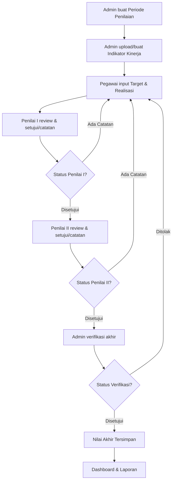
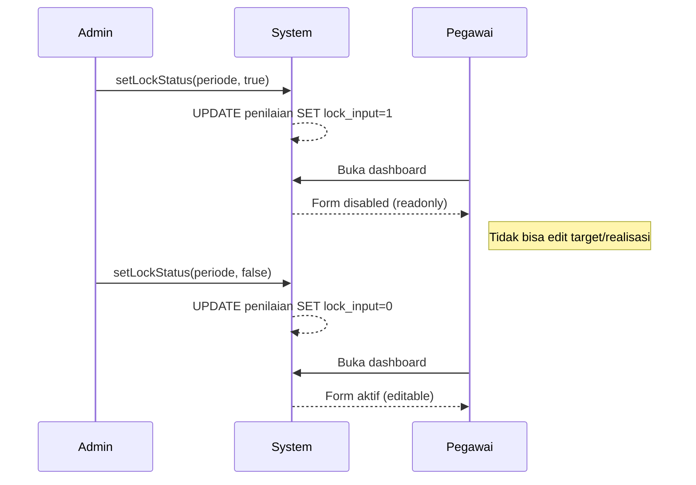
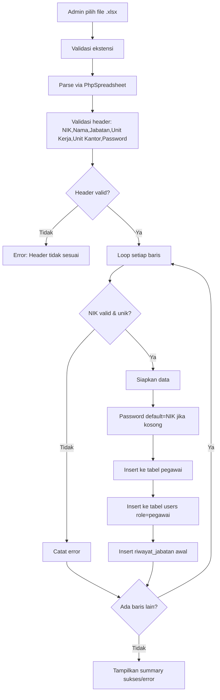
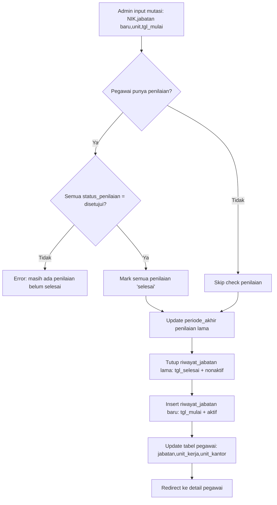
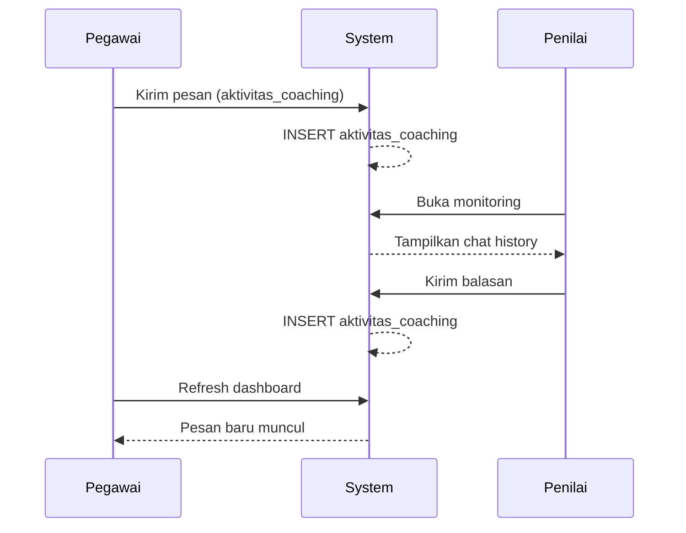
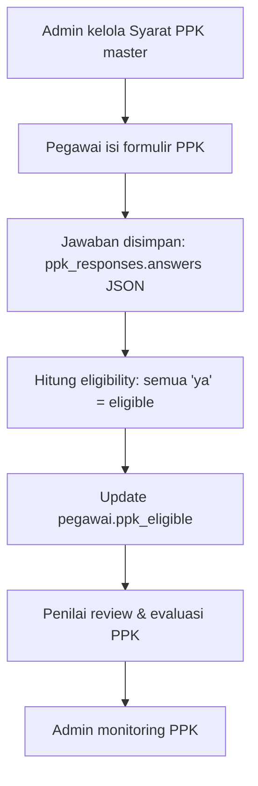

# 10 — Business Flow Documentation

## 1. Alur Utama: Siklus Penilaian Kinerja (SKI)

## 2. Detail Alur per Fase

### Fase 1: Setup Periode & Indikator (Administrator)
1. Admin login → Dashboard
2. Admin menambah **Periode Penilaian** baru (periode_awal, periode_akhir)
3. Admin mengelola **Sasaran Kerja** per jabatan & unit kerja
4. Admin menambah **Indikator Kinerja** untuk setiap sasaran
5. Alternatif: Admin **upload Excel** template indikator (via ExcelImport)

### Fase 2: Input Penilaian (Pegawai)
1. Pegawai login → Dashboard
2. Sistem menampilkan indikator sesuai jabatan & unit kerja pegawai
3. Pegawai mengisi: **Target**, **Batas Waktu**, **Realisasi**
4. Sistem menghitung otomatis: Pencapaian, Nilai, Nilai Dibobot
5. Pegawai mengisi **Nilai Budaya** (skala 1-5 per aspek)
6. Pegawai melihat **Nilai Akhir** (readonly, auto-calculate)
7. Pegawai bisa menambah **Sasaran Baru** / **Indikator Baru** (owner_nik = self)

### Fase 3: Penilaian Penilai I
1. Penilai I login → Menu "Nilai Pegawai"
2. Sistem menampilkan daftar pegawai yang dia nilai (berdasarkan `penilai_mapping`)
3. Penilai I klik pegawai → Review penilaian
4. Penilai I bisa: **Setujui** / **Ada Catatan** per indikator (`status`)
5. Jika semua disetujui → Lanjut ke Penilai II

### Fase 4: Penilaian Penilai II
1. Penilai II login → Menu "Nilai Pegawai"
2. Review yang sama seperti Penilai I
3. Penilai II bisa: **Setujui** / **Ada Catatan** (`status2`)
4. Jika semua disetujui → Siap verifikasi admin

### Fase 5: Verifikasi Administrator
1. Admin → Menu "Verifikasi Penilaian"
2. Admin melihat daftar pegawai per periode
3. Admin memeriksa kelengkapan penilaian
4. Admin bisa: **Setujui** / **Tolak** (`status_penilaian`)
5. Status "disetujui" → Penilaian final dan ter-lock

## 3. Alur Lock/Unlock Input

## 4. Alur Import Pegawai (Excel)

## 5. Alur Mutasi Jabatan

## 6. Alur Coaching

## 7. Alur PPK (Penilaian Perilaku Kerja)

## 8. Predikat Penilaian

| Range Nilai | Predikat |
|-------------|----------|
| < 60 | Minus |
| 60 - 70 | Fair |
| 70 - 80 | Good |
| 80 - 90 | Very Good |
| ≥ 90 | Excellent |
